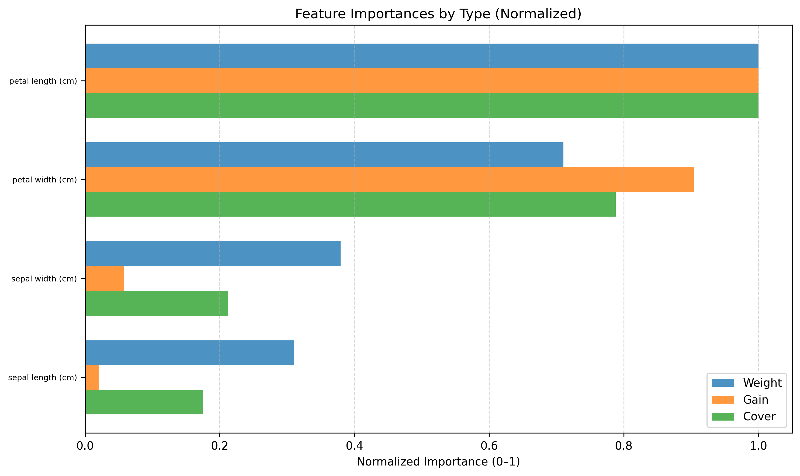
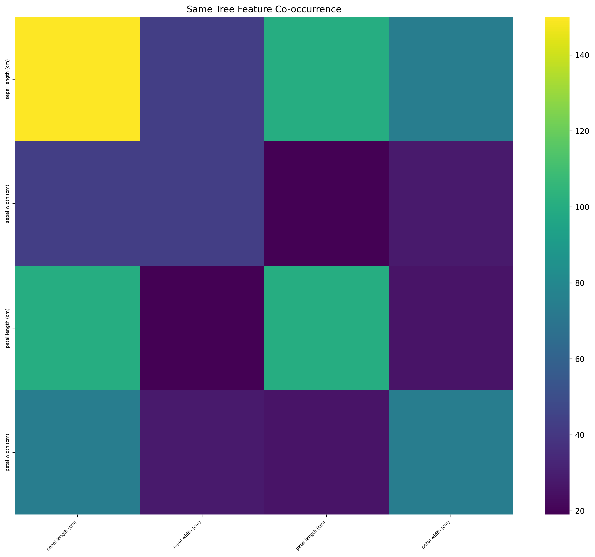

# XGBoost Interpretability Package

A comprehensive toolkit for interpreting and analyzing XGBoost models. This package provides tree-level analysis, feature importance visualization, partial dependence plots, and interactive tree exploration.

## Features

### Tree-Level Analysis (No Data Required)
- **Feature Importance**: Weight, gain, and cover-based importance metrics
- **Tree Structure**: Depth analysis, cumulative gain tracking
- **Feature Interactions**: Co-occurrence analysis at tree and path levels
- **Visualization**: Heatmaps, distributions, and summary statistics

### Model Analysis with Data
- **Partial Dependence Plots (PDP)**: Individual Conditional Expectation (ICE) curves with hybrid grid sampling (uniform + percentile)
- **Accumulated Local Effects (ALE)**: Unbiased feature effect analysis accounting for feature correlations
- **SHAP Analysis**: SHapley Additive exPlanations for model-agnostic feature importance
- **Prediction Analysis**: Score evolution across tree ensembles
- **Marginal Impact**: Feature-specific prediction changes

### Interactive Visualizations
- **Tree Explorer**: Interactive tree structure visualization with Plotly
- **Feature Analysis**: Dynamic exploration of feature relationships
- **Prediction Tracking**: Real-time analysis of model decisions

## Installation

```bash
pip install xgboost-interp
```

### Development Installation

```bash
git clone https://github.com/yourusername/xgboost-interp.git
cd xgboost-interp
pip install -e .
```

### Optional Dependencies

For interactive plots:
```bash
pip install xgboost-interp[interactive]
```

For ALE plots:
```bash
pip install PyALE
```

For SHAP analysis:
```bash
pip install shap
```

## Quick Start

### Basic Tree Analysis

```python
from xgboost_interp import TreeAnalyzer

# Initialize analyzer with your XGBoost model JSON
analyzer = TreeAnalyzer("your_model.json")

# Print model summary
analyzer.print_model_summary()

# Generate feature importance plots
analyzer.plot_feature_importance_combined(top_n=20)
analyzer.plot_feature_importance_distributions(log_scale=True)

# Analyze tree structure
analyzer.plot_tree_depth_histogram()
analyzer.plot_cumulative_gain()
```

### Model Analysis with Data

```python
from xgboost_interp import TreeAnalyzer, ModelAnalyzer

# Initialize analyzers
tree_analyzer = TreeAnalyzer("your_model.json")
model_analyzer = ModelAnalyzer(tree_analyzer)

# Load your data
model_analyzer.load_data_from_parquets("data_directory/")
model_analyzer.load_xgb_model()

# Generate partial dependence plots
model_analyzer.plot_partial_dependence("feature_name")

# Analyze prediction evolution
model_analyzer.plot_scores_across_trees([100, 500, 1000, 2000])

# Plot marginal feature impact
model_analyzer.plot_marginal_impact_univariate("feature_name")
```

### Multi-Class Classification Support

For multi-class models, specify which class to analyze:

```python
from xgboost_interp import TreeAnalyzer, ModelAnalyzer

# Initialize tree analyzer
tree_analyzer = TreeAnalyzer("multiclass_model.json")

# Analyze class 0 (e.g., setosa in Iris dataset)
analyzer_class0 = ModelAnalyzer(tree_analyzer, target_class=0)
analyzer_class0.load_data_from_parquets("data/")
analyzer_class0.load_xgb_model()

# All plots now show effects on P(class 0)
analyzer_class0.plot_partial_dependence("feature_name")
analyzer_class0.plot_marginal_impact_univariate("feature_name")
analyzer_class0.plot_scores_across_trees([30, 60, 90, 120, 150])

# Analyze class 1
analyzer_class1 = ModelAnalyzer(tree_analyzer, target_class=1)
analyzer_class1.load_xgb_model()
analyzer_class1.plot_partial_dependence("feature_name")
```

**Key Points:**
- Specify `target_class` parameter (0, 1, 2, etc.) when creating `ModelAnalyzer`
- All analysis methods show effects on that specific class probability
- Each class has its own set of trees in the XGBoost model
- Plot titles automatically indicate which class is being analyzed

### Interactive Tree Visualization

```python
from xgboost_interp.plotting import InteractivePlotter

# Create interactive tree plots
plotter = InteractivePlotter()
plotter.plot_interactive_trees(
    trees=tree_analyzer.trees,
    feature_names=tree_analyzer.feature_names,
    top_k=10,
    combined=True
)
```

## Visualization Gallery

### Tree Structure Analysis

#### 1. Cumulative Gain
Cumulative loss reduction across the tree ensemble.


*California Housing dataset - shows how model improves with each tree*

#### 2. Feature Importance Scatter Plot
Scatter plot showing feature usage vs gain, with bubble size representing average cover.


*California Housing dataset - bubble chart revealing the relationship between feature usage frequency, gain, and cover*

#### 3. Feature Importance Combined
Combined view of feature importance across weight, gain, and cover metrics.


*California Housing dataset - shows MedInc (median income) as the most important feature*

#### 4. Marginal Impact
Feature-specific prediction changes across all splits in the model. Shows how the model's prediction changes in different ranges of a feature based on the tree structure alone (no data required). The step function displays the marginal prediction change at each threshold, with color intensity indicating the magnitude of impact.


*Iris dataset - marginal impact of petal length on class 2 probability. Strong positive impact in the 3-4.5cm range (darker green) indicates higher probability for class 2 (virginica). Negative impact below 3cm (red) suggests lower probability. The step function shows exact prediction changes at each split threshold across all 150 trees.*

#### 5. Partial Dependence Plot (PDP)
Shows how predictions change as a feature varies, with ICE curves for individual samples. Uses hybrid grid (100 uniform + 100 percentile points) for comprehensive coverage of continuous features.


*California Housing dataset - MedInc (median income) shows strong positive relationship with house value*

#### Interactive Tree Visualization
Interactive tree structure exploration with hover information for splits and leaf values.


*Iris dataset - Tree 1 showing decision structure with split conditions and gains*


*Iris dataset - Tree 4 demonstrating deeper splits and leaf predictions*

#### Feature Usage Heatmap
Heatmap showing which features are used together in trees.


*California Housing dataset - reveals feature co-occurrence patterns*

#### Tree-Level Feature Co-occurrence
Symmetric matrix showing how often pairs of features appear in the same tree.


*California Housing dataset - darker colors indicate features frequently used together in trees*

#### Path-Level Feature Co-occurrence
Symmetric matrix showing how often pairs of features appear on the same root-to-leaf decision path (log scale).


*California Housing dataset - reveals tighter feature interactions along decision paths*

#### Sequential Feature Co-occurrence
Asymmetric matrix showing conditional probabilities: when a feature (row) splits, what's the probability that another feature (column) is the immediate next split? This reveals directional parent→child feature dependencies in the tree structure.


*California Housing dataset - shows which features tend to follow others in decision paths. High values indicate strong sequential dependencies (e.g., after splitting on feature A, the model frequently splits on feature B next)*

#### Accumulated Local Effects (ALE) Plot
Unbiased feature effect visualization that accounts for feature correlations. ALE plots show the marginal effect of a feature on predictions while properly handling correlated features, making them superior to PDPs when features are correlated.


*California Housing dataset - ALE plot for HouseAge showing the local effect on house value predictions. The shaded region indicates 95% confidence intervals. The plot reveals a non-linear relationship where house age has varying impacts on value across different age ranges.*

#### SHAP Analysis
SHAP (SHapley Additive exPlanations) provides model-agnostic explanations by computing the contribution of each feature to individual predictions.

**SHAP Summary Beeswarm Plot**: Shows feature importance and effect direction across all samples.


*California Housing dataset - each dot represents a sample, colored by feature value (red=high, blue=low). Position on x-axis shows impact on prediction. MedInc (median income) has the strongest effect, with high values consistently pushing predictions higher.*

**SHAP Waterfall Plot**: Explains individual predictions by showing how each feature pushes the prediction from the base value.


*California Housing dataset - waterfall plot for sample 2. Starting from the base value (E[f(x)] = 2.07), features like MedInc (+0.47) and Latitude (+0.37) push the prediction higher, while AveOccup (-0.04) slightly reduces it. Final prediction: f(x) = 2.99.*

#### Feature Gain Distribution
Distribution of gain values across all splits for each feature.


*Iris dataset - boxplot showing gain distributions per feature*

#### Tree Depth Distribution
Histogram showing the distribution of tree depths in the ensemble.


*Iris dataset - most trees have depths between 2-5*

#### Gain Statistics Per Tree
Box plots showing gain statistics for each tree in the ensemble.


*California Housing dataset - gain distribution across all 100 trees*

#### Prediction Statistics Per Tree
Statistical analysis of leaf predictions across the ensemble.


*California Housing dataset - mean, median, and standard deviation of predictions per tree*

#### Prediction Evolution Across Trees
Shows how predicted probabilities change as more trees are added to the ensemble.


*Iris dataset - class probability evolution showing model convergence across the ensemble*

## API Reference

### TreeAnalyzer

The main class for tree-level analysis that doesn't require data.

**Key Methods:**
- `print_model_summary()`: Display model metadata and structure
- `plot_feature_importance_combined()`: Normalized importance by weight, gain, cover
- `plot_feature_importance_distributions()`: Boxplots of importance distributions
- `plot_tree_depth_histogram()`: Distribution of tree depths
- `plot_cumulative_gain()`: Cumulative loss reduction across trees
- `plot_feature_usage_heatmap()`: Feature co-occurrence patterns
- `plot_gain_stats_per_tree()`: Gain distribution across trees
- `compute_tree_level_feature_cooccurrence()`: Compute features appearing in same tree
- `compute_path_level_feature_cooccurrence()`: Compute features on same decision paths
- `compute_sequential_feature_dependency()`: Compute parent→child feature dependencies
- `plot_tree_level_feature_cooccurrence()`: Plot tree-level co-occurrence heatmap
- `plot_path_level_feature_cooccurrence()`: Plot path-level co-occurrence heatmap
- `plot_sequential_feature_dependency()`: Plot sequential feature co-occurrence heatmap

### ModelAnalyzer

Extended analysis requiring actual data examples.

**Key Methods:**
- `load_data_from_parquets()`: Load data from parquet files
- `load_xgb_model()`: Load XGBoost model for predictions
- `plot_partial_dependence()`: PDP with ICE curves
- `plot_ale()`: Accumulated Local Effects plots
- `plot_scores_across_trees()`: Prediction evolution analysis
- `plot_marginal_impact_univariate()`: Feature-specific impact analysis

## Examples

See the `examples/` directory for comprehensive usage examples:

- `sklearn_dataset_example.py`: Complete example with California Housing dataset (regression)
- `iris_classification_example.py`: Classification example with Iris dataset  
- `user_model_complete_analysis.py`: **Run ALL analysis functions on your own model** 🌟
- `basic_analysis.py`: Tree-level analysis without data (requires your model)
- `advanced_analysis.py`: Full model analysis with data and interactions (requires your model)

### Running Examples

```bash
# Easy way - use the runner script
python run_examples.py

# Or run individual examples
python xgboost_interp/examples/sklearn_dataset_example.py
python xgboost_interp/examples/iris_classification_example.py

# Analyze your own model (NEW!)
python xgboost_interp/examples/user_model_complete_analysis.py your_model.json
python xgboost_interp/examples/user_model_complete_analysis.py your_model.json data_dir/
```

The sklearn examples are self-contained and include:
- Data loading and preprocessing
- XGBoost model training (100 trees for housing, 50 for iris)
- Model saving as JSON
- Complete interpretability analysis

### Complete Analysis of Your Own Model

The `user_model_complete_analysis.py` script runs **ALL** available analysis and plotting functions:

```bash
# Tree-level analysis only (no data needed) - generates ~15 plots
python xgboost_interp/examples/user_model_complete_analysis.py model.json

# Complete analysis with data - generates 15+ plots + PDPs + marginal impacts for ALL features
python xgboost_interp/examples/user_model_complete_analysis.py model.json data_directory/

# Multi-class: analyze specific class
python xgboost_interp/examples/user_model_complete_analysis.py model.json data_dir/ --target-class 0
```

This example demonstrates:
- ✅ All 15 tree-level analysis functions
- ✅ Partial dependence plots for ALL features
- ✅ Marginal impact analysis for ALL features
- ✅ Prediction evolution across trees
- ✅ Interactive tree visualizations
- ✅ Comprehensive summary report

## Requirements

- Python 3.7+
- numpy >= 1.19.0
- pandas >= 1.2.0
- matplotlib >= 3.3.0
- seaborn >= 0.11.0
- scikit-learn >= 0.24.0
- scipy >= 1.6.0
- xgboost >= 1.4.0

### Optional Dependencies
- plotly >= 5.0.0 (for interactive plots)
- networkx >= 2.5.0 (for tree visualization)
- pyALE >= 0.2.0 (for ALE plots)

## Contributing

Contributions are welcome! Please feel free to submit a Pull Request.

1. Fork the repository
2. Create your feature branch (`git checkout -b feature/AmazingFeature`)
3. Commit your changes (`git commit -m 'Add some AmazingFeature'`)
4. Push to the branch (`git push origin feature/AmazingFeature`)
5. Open a Pull Request

## License

This project is licensed under the MIT License - see the LICENSE file for details.

## Citation

If you use this package in your research, please cite:

```bibtex
@software{xgboost_interp,
  title={XGBoost Interpretability Package},
  author={Greg Kocher},
  year={2025},
  url={https://github.com/yourusername/xgboost-interp}
}
```

## Changelog

### v0.1.0 (2025-01-XX)
- Initial release
- Tree-level analysis functionality
- Model analysis with data support
- Interactive visualizations
- Comprehensive plotting utilities
